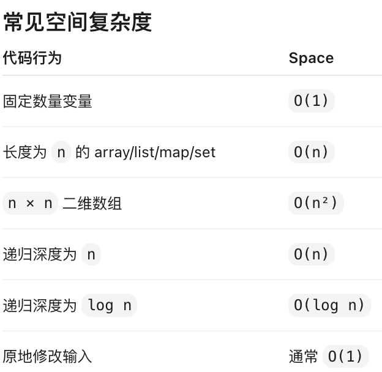

# API / HTTP

## day01
### What is a REST API?
A REST API is an architectural style for designing APIs. This api is built aorund on resources. resource is represented by the URL after the HTTP methods. It uses HTTP methods such as GET, POST, PUT, DELETE to perform operations on resources. e.g. GET /users/123 means we want the info about the user with ID 123. 

### How is HTTP realted to REST?
HTTP provides the communication protocol, while REST defines how we organize and interact with resources through that protocol.
### What is the difference between GET and POST?
GET is used to retrieve data from the server, but POST is commonly used to create new resource on the server.
### What is the difference between PUT and POST?
PUT is used to update existing resource on the server, but POST is used to create a new resource on the server.
### What does "idempotent" mean in HTTP?
idempotent means: Making the same request multiple times has the same intended effect on the server as making it once.

``` 
GET /users/123

PUT /users/123
{
    "name":"Andy"
}
```
GET/PUT/DELETE => Idempotent \
POST => non Idempotent since if we make request 3 times, multiple resources may get created:
```
POST /orders
Order 101
Order 102
Order 103
```

### PATCH vs PUT:
PUT is generally used to replace or fully update an existing resource, but PATCH is used to partially update an resource. For example, if I only want to update an user's name, I can use PATCH and send only the name field.
```
PUT /users/123
{
  "name": "Andy Liu",
  "email": "andy@example.com",
  "age": 23
}
```

```
PATCH /users/123
{
  "name": "Andy Liu",
  "email": "andy@example.com",
  "age": 23
}
```

### API endpoint
An API endpoint is an specific URL where a client can access an resource. e.g. https://api.example.com/users/123 is an endpoint for accessing user 123.

### What is the difference between a path parameter and a query parameter?

`123` in `/users/123` is a path parameter(更抽象一点其实是`/users/{id}`), but `id=123` in `/users?id=123` is query parameter. query parameter is usally used to filter/sort/search/pagination...


`GET /users/123` Get user 123 \
`GET /users?country=Canada` Get users whose country is Canada. 
`GET /users?sort=name` get users and sort by name.

### What is the difference between an HTTP request and an HTTP response?
HTTP request is sent by client to a server to perform an operation on a resource. It usually contains an HTTP method, URL, headers, and sometimes a request body. An HTTP response is sent back by a server after processing the request. It usually contains the status code, headers, and sometimes a response body.

### What is an HTTP header? Can you give me one example?
```
common header examples(suppose we have following headers in HTTP requests):
Content-Type: application/json → body 是 JSON 格式
Authorization: Bearer <token> → 带认证 token
Accept: application/json → client 希望 server 返回 JSON
```

HTTP headers contain additional information about the HTTP request or response. For exmaple, `Content-Type: application/json` tells that the request/response body is in JSON format.

## day02
### The difference between request body and response body
request body is the data send to the server, but response body is the data returned to client.
```
POST /users
Content-Type: application/json

{
  "name": "Andy",
  "email": "andy@example.com"
}

request body here is the data used to create a new user.
```

### What is the difference between a request body and a payload?
request body contains the data being sent
JSON payload is the actual data being trasimitted

### What are the main components of an HTTP request?
The main components of an HTTP request are the HTTP method, the URL, headers, and sometimes a request body.

The method tells the server what operation to perform, the URL identifies the target resource, headers provide additional information about the request, and the body contains the data being sent when needed.

## day02
### status code 200
all code 2xx means sucessful 

### What does status code `200 OK` mean?
HTTP status code `200 OK` means the request was successfully received by server, processed by the server, and returned response.

### Difference between `200 OK` and `201 Created`.
`200 OK` means the request was successfully processed by server. `201 Created` means the request was successfully processed and one new resource was created.

### status code 4XX
4XX all means something wrong with the request

### 204 No Content:
`204 No Content` means the request was processed successfully, but the server has no response body to return.
`DELETE /users/123` is successful, but no data is needed to be returned so in this case status code will be `204 No Content`. 删除成功了，但是没有额外数据需要返回给client.

### 400 Bad Request:
400 Bad Request means the server received the request, but the request was invalid or malformed, so the server could not process it. \
e.g. request body 缺少required field
```
POST /users
Content-Type: application/json

{
  "email": "andy@example.com"
}

如果 API 要求必须有 name，但你没传，server 可能返回400 Bad Request
```

### What does 401 Unauthorized mean?
`401 Unauthorized` means the client is not authenticated properly due to missing authorization header/invalid token/expired token.

### Difference between 401 Unauthorized and 403 Forbidden
401 unauthorized: server does not know who client is(missing authorization header/invalid/expired token)
403 Forbidden: Server knows who I am but I dont have permission to perform requested operation or I dont have permission to access the resource or both. `DELETE /admin/users/123` since this endpoint may requires admin.
有可能是这个user是普通用户没有权限acess resource
也有可能这个user指有读权限没有删除/写的权限
也有可能这个user既是普通用户也只有读的权限。

401 Unauthorized means the client is not authenticated properly(missing authorization header/invalid/expired token). 403 Forbidden means the client is authenticated but has no permission to perform the requested operation on the resource.

### 404 Not Found
404 Not Found means the server cannot find the requested resource.


### status code 5XX
all status code 5XX means there is something wrong when server process the request.

### 500 Internal Server Error
500 Internal Server Error means that while the server process the request, it got some unexpected errors and could not complete the request successfully(e.g. Database connection failed)


